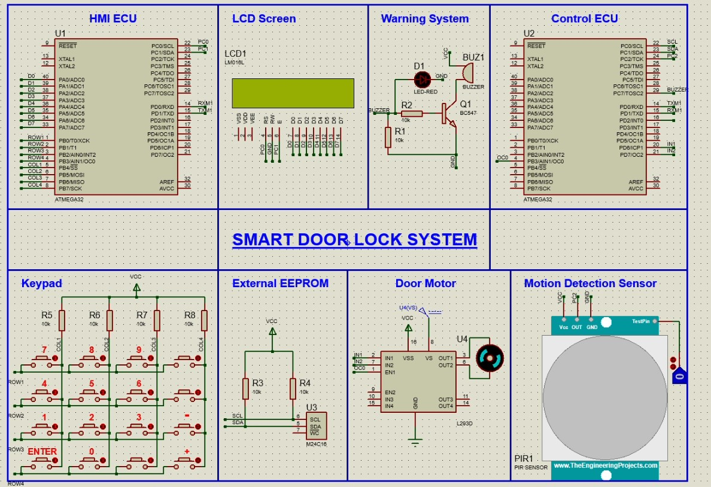

# Door Locker Security System (Dual MCU)

## Overview
This project is a **Dual Microcontroller-Based Door Locker Security System** implemented using **two ATmega32 microcontrollers** and simulated in **Proteus**. The system uses a password-based authentication mechanism where the user interacts through an **LCD + Keypad (HMI_ECU)**, while the **Control_ECU** handles verification, EEPROM storage, motor control, PIR sensing, and alarm actions.  
The two ECUs communicate reliably via **UART**.

## Features
✔ **Dual ECU Architecture**
- **HMI_ECU**: LCD + Keypad interface for user interaction.
- **Control_ECU**: password verification, EEPROM, motor control, PIR, buzzer.

✔ **Password Authentication**
- Create and confirm a **5-digit password**
- Password stored in **external EEPROM** using I2C. 

✔ **UART Communication**
- HMI_ECU sends entered passwords/options to Control_ECU via **UART**. 

✔ **Door Control System**
- DC motor controlled using **H-Bridge**
- Door unlock/lock sequence with status messages on LCD. 

✔ **PIR Motion Detection**
- PIR sensor keeps the door open while motion is detected.

✔ **Security Lockout System**
- If the password is entered incorrectly **3 consecutive times**:
  - buzzer alarm for **1 minute**
  - system locks (no keypad input accepted) for 1 minute.

✔ **Change Password Option**
- User can change the password after correct verification.

## Hardware Components
### HMI_ECU
- **ATmega32**
- **LCD (2x16, 8-bit mode)**
- **Keypad (4x4)**

### Control_ECU
- **ATmega32**
- **External EEPROM (I2C)**
- **DC Motor + H-Bridge**
- **Buzzer**
- **PIR Motion Sensor**

## System Flow (How It Works)
1. **Create Password**
   - user enters password twice for confirmation
   - if matched → stored in EEPROM
2. **Main Menu**
   - `+ : Open Door`
   - `- : Change Password`
3. **Open Door**
   - password verified
   - motor rotates to unlock then waits for PIR motion
   - door locks again after no motion is detected
4. **Change Password**
   - password verified
   - system re-enters password creation flow
5. **Wrong Password**
   - retries up to 3 times
   - 3rd failure triggers 1-minute alarm + lockout 

## Proteus Simulation
The system was fully designed and tested using **Proteus simulation**, including:
- UART link between both ECUs
- LCD & keypad interface
- EEPROM I2C storage
- motor driver and PIR sensor integration 

## How to Run (Proteus)
1. Open the Proteus project file.
2. Build each ECU code separately and generate **HEX files**.
3. Load:
   - HMI_ECU hex into HMI ATmega32
   - Control_ECU hex into Control ATmega32
4. Run the simulation and interact via the keypad.

## Future Improvements
- Add **RFID / NFC authentication**
- Add **Bluetooth / UART logging**
- Add EEPROM encryption for stronger password security
- Add RTC for timestamp-based logs

## Author
👤 **Malik Babiker**  

## License
This project is licensed under the **MIT License** — see the [LICENSE](LICENSE) file for details.

